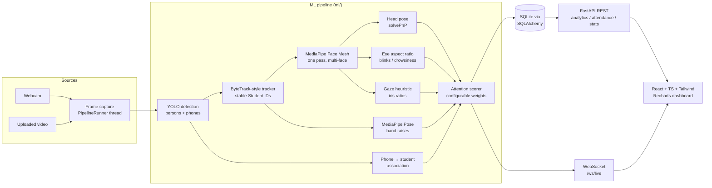
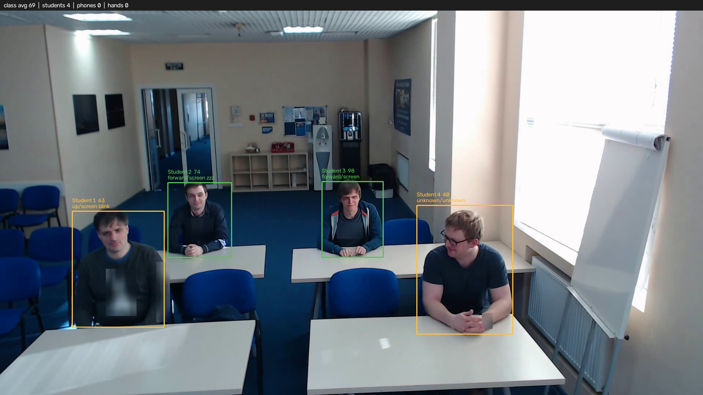
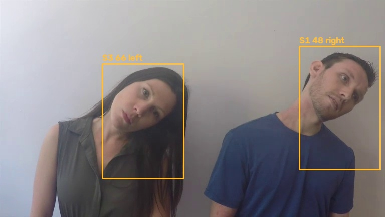
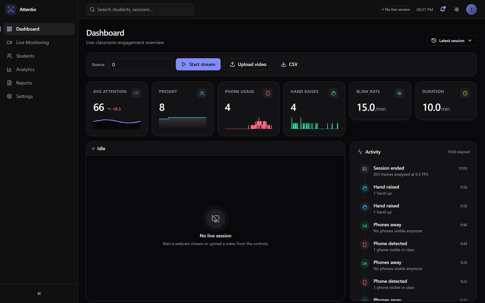
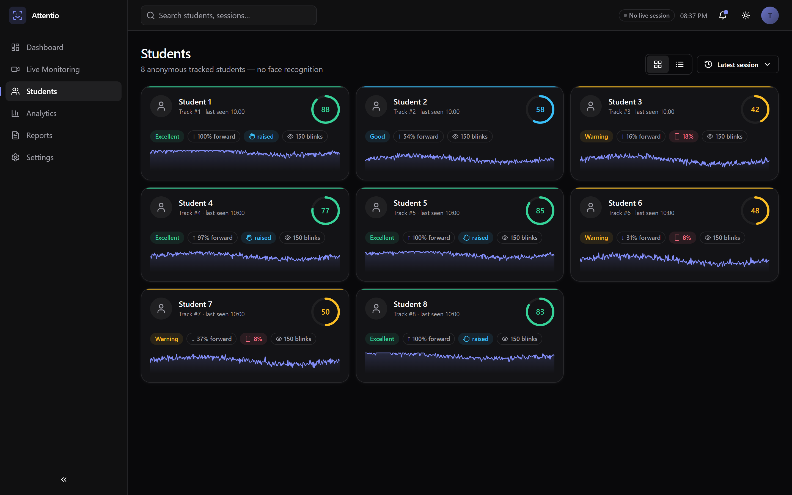
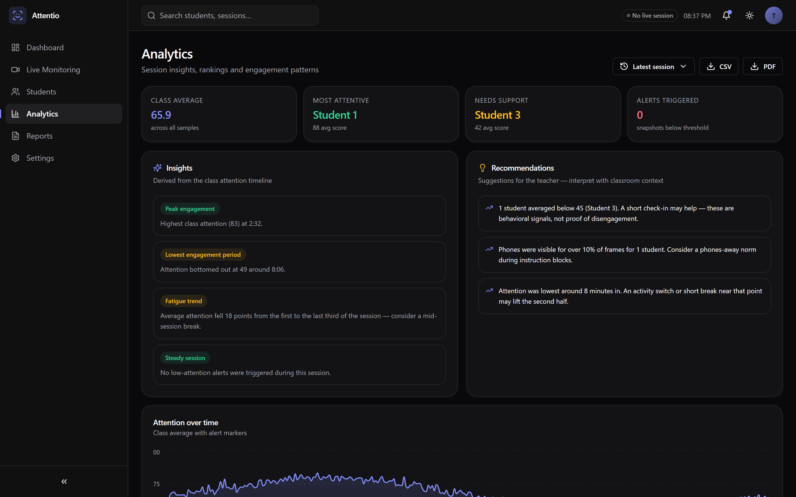

# Classroom Attention Monitoring System

Real-time estimation of **observable classroom engagement** from webcam or
recorded video. Detects and anonymously tracks each student, estimates head
pose, blinks/drowsiness, gaze direction, phone usage and hand raises, fuses
them into an **explainable, configurable attention score (0–100)**, and
serves live video + analytics to a teacher-facing dashboard.

**[▶ Live demo](https://dushyantbaroliya.github.io/classroom-attention-monitor/)** —
the real dashboard running on a recorded session. Live webcam capture needs the
Python pipeline running locally (see [Quick start](#quick-start-docker--recommended)).

> ⚠️ This system estimates *behavior*, not cognition, and is a
> decision-support tool — see [Ethical considerations](#ethical-considerations).

---

## Highlights

- **Modular ML pipeline** — every stage (detection, tracking, head pose, EAR,
  gaze, hands, scoring) is an independent, unit-tested module behind a small
  interface; the detector/analyzer implementations are dependency-injected, so
  the entire pipeline runs in CI with scripted fakes and zero model downloads.
- **Two interchangeable detector backends** — a torch-free **MediaPipe**
  backend (EfficientDet-Lite, the default — the whole pipeline runs on just
  `mediapipe` + downloaded model bundles) and an optional **YOLO** backend
  (Ultralytics, GPU-capable). Selected in one config line.
- **Verified on real footage** — detects and scores all four students in a
  real classroom clip end-to-end; see [Verification](#verification) for the
  annotated output and measured numbers, not just claims.
- **Self-contained ByteTrack-style tracker** — Kalman + two-stage Hungarian
  association (high/low confidence), with re-identification after occlusion.
- **Explainable scoring** — the API reports *why* each student got their
  score (`{"head_forward": +30, "phone_detected": -20, ...}`); weights live
  in `config.yaml`, not code.
- **Production-shaped backend** — FastAPI + SQLAlchemy 2.0 + Alembic,
  structured JSON logging, dependency injection, WebSocket live feed,
  Dockerized with an nginx-served React dashboard.
- **Premium analytics dashboard** — a six-page SaaS-style app (Dashboard,
  Live Monitoring, Students, Analytics, Reports, Settings) built on
  shadcn-style primitives, React Query, Recharts, TanStack Table and Framer
  Motion, with light/dark themes, skeleton loading, empty/error states and
  keyboard-accessible navigation.
- **106 passing tests** (on both Python 3.11–3.12 CV envs and a light
  CV-free env) covering scoring, pose math, blink state machine, gaze,
  tracker behavior, analytics SQL and every API endpoint.

## Architecture



## Folder structure

```
classroom-attention-monitor/
├── backend/app/            # FastAPI application
│   ├── api/                #   routes + dependency injection
│   ├── core/               #   typed config loader, structured logging
│   ├── services/           #   PipelineRunner (background session worker)
│   ├── schemas.py          #   Pydantic request/response models
│   └── main.py             #   app factory (asgi.py = entrypoint)
├── ml/
│   ├── models/             # YOLO + MediaPipe wrappers (lazy heavy imports)
│   ├── tracking/           # Kalman filter + ByteTrack-style tracker
│   ├── attention/          # head pose, EAR, gaze, hands, phone, scoring
│   ├── pipeline.py         # orchestrates one frame end-to-end
│   ├── annotate.py         # overlay renderer
│   └── types.py            # dataclasses shared across stages
├── analytics/              # SQL aggregation + CSV export
├── database/               # SQLAlchemy models, CRUD, Alembic migrations
├── frontend/               # React 18 + TypeScript + Tailwind dashboard
│   └── src/
│       ├── components/ui/  #   design-system primitives (button, card, …)
│       ├── components/     #   dashboard / live / students / layout features
│       ├── pages/          #   one file per route
│       ├── hooks/          #   React Query data hooks, theme, live feed
│       └── lib/            #   utils + insight/event derivation
├── tests/                  # pytest suite (incl. scripted-fake pipeline)
├── scripts/seed_demo.py    # synthetic session for instant dashboard demo
├── docker/                 # backend + frontend Dockerfiles, nginx.conf
├── sample_videos/          # put test footage here
├── config.yaml             # ALL tunables: weights, thresholds, paths
└── docker-compose.yml
```

## Quick start (Docker — recommended)

```bash
git clone <repo> && cd classroom-attention-monitor
docker compose up --build
```

- Dashboard: http://localhost:5173
- API docs (Swagger): http://localhost:8000/docs

The MediaPipe model bundles are fetched during the image build via
`scripts/download_models.py`; the optional YOLO backend downloads its own
`yolov8n.pt` on first inference.

> Webcam inside Docker works on Linux via the `devices:` mapping in
> `docker-compose.yml`. On Windows/macOS, upload video files instead, or run
> the backend natively (below) for direct camera access.

## Running locally (no Docker)

Requires **Python 3.11 or 3.12** (MediaPipe does not support 3.13+ yet) and
Node 18+.

```bash
# Backend
python -m venv .venv && source .venv/bin/activate   # .venv\Scripts\activate on Windows
pip install -r requirements.txt                      # torch-free MediaPipe backend
python scripts/download_models.py                    # face + pose + detector bundles
alembic upgrade head                                 # create the SQLite schema
uvicorn backend.app.asgi:app --port 8000

# Frontend (second terminal)
cd frontend && npm install && npm run dev            # http://localhost:5173
```

The default detector backend is **MediaPipe** — no torch needed. To use the
optional **YOLO** backend instead, `pip install -r requirements-yolo.txt` and
set `detection.backend: yolo` in `config.yaml`.

**Instant demo without a camera or models:**

```bash
python scripts/seed_demo.py     # seeds a synthetic 10-minute, 8-student lesson
```

**Verify the real pipeline on a video:**

```bash
python scripts/verify_pipeline.py --source sample_videos/classroom.mp4 \
    --save-annotated docs/screenshots/annotated_classroom.jpg
```

then open the dashboard.

### Configuration

Everything tunable lives in [config.yaml](config.yaml): video source, model
paths, device (`auto`/`cpu`/`cuda`), detector confidence, tracker thresholds,
head-pose/EAR/gaze thresholds, **scoring weights**, snapshot cadence, storage
paths. Point the app at another file with `CAM_CONFIG=/path/to/config.yaml`.

```yaml
scoring:
  weights:
    head_forward:     { weight: 30 }
    gaze_screen:      { weight: 25 }
    eyes_open:        { weight: 15 }
    hand_raised:      { weight: 10, bonus: true }   # bonus: not needed for 100
    phone_detected:   { weight: -20 }
    eyes_closed_long: { weight: -15 }
```

The score is the sum of triggered weights mapped linearly onto 0–100
(negatives → 0, non-bonus positives → 100). Every API/WebSocket payload
includes the per-rule breakdown, so the dashboard can always answer
*"why is this score low?"*.

## REST API

Interactive documentation is auto-generated at `/docs` (Swagger) and `/redoc`.

| Method | Path | Description |
|---|---|---|
| GET | `/health` | Liveness + whether CV deps are installed + active session |
| POST | `/video/upload` | Multipart upload; starts analyzing the file as a new session |
| POST | `/stream/start` | Start webcam/file session `{source?, session_name?}` |
| POST | `/stream/stop` | Gracefully stop the running session |
| GET | `/sessions` | Recent sessions |
| GET | `/students?session_id=` | Per-student engagement aggregates |
| GET | `/students/{id}/timeline?session_id=` | One student's attention over time |
| GET | `/analytics?session_id=` | Session summary + class timeline + per-student stats |
| GET | `/analytics/export.csv?session_id=` | CSV download of per-student metrics |
| GET | `/attendance?session_id=` | Anonymous attendance (Student N, first/last seen, presence %) |
| GET | `/statistics?session_id=` | Headline numbers (class average, alerts, most/least engaged) |
| WS | `/ws/live` | ~10 Hz push: annotated JPEG + per-student live analytics |

`session_id` is optional everywhere — it defaults to the active session, then
the most recent one.

## Feature notes

### Detector backends
The detector is dependency-injected behind a small `Detector` protocol, with
two interchangeable implementations selected by `detection.backend`:

- **`mediapipe`** (default, torch-free) — MediaPipe Tasks **EfficientDet-Lite**
  detects **persons** and **cell phones** (COCO). The whole pipeline then runs
  on just `mediapipe` + the downloaded `.task`/`.tflite` bundles.
- **`yolo`** (optional, GPU-capable) — Ultralytics YOLO; a COCO model detects
  persons + phones in one pass, or set `detection.face_model_path` to a
  dedicated YOLO face model.

For each tracked person, MediaPipe **FaceLandmarker** (Tasks API, 478
landmarks incl. iris) analyzes that person's cropped-and-upscaled region —
this is what makes small, distant classroom faces detectable, since MediaPipe's
built-in face detector is short-range and misses faces that occupy little of
the full frame. Tracker IDs are stable across occlusions
(`tracking.max_lost_frames`), giving the anonymous `Student N` identities.

> MediaPipe 0.10.x removed the legacy `mp.solutions` API; this project uses
> the current **Tasks API** throughout (`mediapipe.tasks.python.vision`).

### Attendance without face recognition
Attendance = tracker presence: first seen, last seen, % of frames present.
**Face recognition is intentionally excluded.** The `Student` table isolates
identity behind `track_id`/`label`, so an *opt-in* recognition module could
later attach names without touching any other table or module.

### Gaze estimation limitations
Gaze is a **heuristic** on MediaPipe iris landmarks (iris position ratios
inside the eye corners, combined with head pitch to separate
notebook-reading from generic looking-down). It is calibration-free and
therefore coarse: it cannot tell *where on the screen* someone looks,
degrades with strong head turns, glasses glare, low light and small/distant
faces, and should be read as a directional signal only. A calibrated,
learning-based gaze model is on the roadmap.

### Performance
Per-student cost dominates: each tracked person gets a FaceLandmarker pass
(and, when enabled, a Pose pass for hand raises), so throughput scales with
class size. Measured on this dev machine (CPU-only, MediaPipe backend — see
[Verification](#verification)): ~2.8 FPS on a 4-person **1080p** classroom
clip with pose on, and ~8.8 FPS on a 2-person 432p clip. Levers for higher
throughput: `video.process_every_n` (analyze every Nth frame), lower
`video.width/height`, `mediapipe.enable_pose: false`, or the GPU YOLO backend.
Capture, inference and persistence run in a background thread; DB writes are
batched; the WebSocket serves the latest frame without back-pressuring the
pipeline. The original **20+ FPS GPU / 10+ FPS CPU** target is realistic at
720p with fewer students and pose subsampled or on GPU.

## Testing

```bash
pytest            # 106 tests, no GPU/model downloads needed
```

The suite covers: scoring normalization/explainability/config, head-pose
Euler math and classification, the EAR blink/drowsiness state machine, gaze
thresholds, hand-raise debouncing, phone association, tracker identity
stability + occlusion re-id + low-confidence recovery, analytics SQL
aggregation, CSV export, and all API endpoints including a full
upload→process→analytics round trip using a synthetic video and scripted
fake models. All 106 pass on both a Python 3.12 environment with the full CV
stack and a light CV-free environment (the pipeline is dependency-injected).

## Verification

Beyond unit tests (which use fakes), the **real models** were run end-to-end
on real footage via `scripts/verify_pipeline.py`, using Intel's CC-BY-4.0
[sample videos](https://github.com/intel-iot-devkit/sample-videos):

| Clip | Result |
|---|---|
| `classroom.mp4` (4 people, 1080p) | 4/4 students detected & tracked every frame; face landmarks on 155/160 samples; real per-student scores (e.g. forward + screen + eyes-open → 98; turned-away face → unknown → 40); ~2.8 FPS CPU |
| `head-pose-…-female-and-male.mp4` (2 people) | head pose tracks deliberate turns (left/right), EAR catches blinks (mean 0.34, dips <0.21), gaze distributes across screen/notebook/right/down; ~8.8 FPS CPU |

Annotated outputs are in `docs/screenshots/` (regenerate with the
`--save-annotated` flag). Honest limitations surfaced by real footage:
solvePnP head-pose angles get unstable at extreme profile turns, and a fully
turned-away face yields no landmarks (correctly reported as `unknown`).

## Dashboard

A six-page analytics app, not a single scrolling panel:

| Page | What it shows |
|---|---|
| **Dashboard** | Six hero metrics with sparklines and trend deltas, live feed, activity timeline, attention area chart, distribution + phone donut |
| **Live Monitoring** | Large annotated video panel with per-student overlays (ID, attention, head-direction, phone and hand icons), FPS badge, and a live roster with attention rings |
| **Students** | Card grid (attention ring, status band, behavior badges, per-student sparkline) with a TanStack Table view — sortable, filterable, paginated |
| **Analytics** | Auto-derived insights and teacher recommendations, student ranking, blink trends, and a students × time engagement heatmap |
| **Reports** | Print-optimized session summary with roster table (`Print / PDF` hides chrome via print styles) |
| **Settings** | Theme, live backend/pipeline health, and the ethics guardrails |

Design details: design-token color system (light `#FAFAFA` / dark `#09090B`),
Inter Variable self-hosted, status bands (excellent/good/warning/critical)
applied consistently across rings, badges, bars and charts, skeleton loading
instead of spinners, illustrated empty states, calm error states with retry,
route-level code splitting and vendor chunking, `aria-label`s on all controls
and visible focus rings throughout.

### Screenshots

**Real pipeline output** (annotated by `scripts/verify_pipeline.py`):

| Classroom (4 students, full pipeline) | Head pose (2 students) |
|---|---|
|  |  |

**Dashboard** (real captures of the running app on the seeded demo session):

| Dashboard | Students | Analytics |
|---|---|---|
|  |  |  |

Light-theme variants (`*-light.png`) plus `live.png` and `reports.png` are in
`docs/screenshots/`. Regenerate any of them with the dev servers running:

```bash
python scripts/capture_screenshots.py   # Playwright + system browser, 2x
```

## Ethical considerations

This project is deliberately scoped as a **decision-support tool for
educators**, and several guardrails are built in rather than bolted on:

1. **Behavior ≠ attention.** The system measures *observable proxies* (head
   orientation, eyelid aperture, iris position, posture). A student staring
   at the board may be daydreaming; one looking down may be taking careful
   notes. Scores are estimates with irreducible uncertainty and must never be
   treated as ground truth about a person's mind.
2. **No face recognition, by design.** Students are anonymous tracker IDs
   (`Student 3`). No embeddings, names or biometric identifiers are computed
   or stored.
3. **Local processing.** Video is processed on-device/on-premises; nothing
   is sent to external services. Only derived numeric analytics are stored,
   in a local SQLite file you control.
4. **Consent first.** Obtain informed consent from everyone recorded (and
   guardians where applicable) before running any session. Follow your
   institution's policies and local law (e.g. GDPR/FERPA equivalents).
5. **Not for grading or discipline.** Outputs are aggregate teaching
   feedback ("attention dipped 40 minutes in — maybe a break helps"), not
   evidence for evaluating or punishing individuals. Per-student data exists
   to help teachers notice who might need support, and should be interpreted
   by a human in context.
6. **Bias awareness.** Detector and landmark models can perform unevenly
   across skin tones, face shapes, eyewear and lighting. Treat per-student
   comparisons with particular caution.

## Future improvements

- Classroom attention heatmap (spatial grid over seat positions)
- Session replay: scrub through stored frames with overlays
- Threshold alerts pushed over the WebSocket (toast + sound in dashboard)
- Multi-classroom: one backend container per room + aggregating gateway
- PDF report export (per-lesson summary for teachers)
- Calibrated appearance-based gaze model to replace the heuristic
- Optional opt-in identity module (attendance by name) with consent workflow
- ONNX/TensorRT export path for higher FPS on edge devices

## License & credits

Built with [Ultralytics YOLO](https://github.com/ultralytics/ultralytics),
[MediaPipe](https://developers.google.com/mediapipe),
[FastAPI](https://fastapi.tiangolo.com/), [SQLAlchemy](https://www.sqlalchemy.org/),
[React](https://react.dev/), [Radix UI](https://www.radix-ui.com/),
[Recharts](https://recharts.org/), [TanStack Query & Table](https://tanstack.com/)
and [Framer Motion](https://www.framer.com/motion/).
Tracker follows the ByteTrack association idea (Zhang et al., ECCV 2022);
EAR follows Soukupová & Čech (2016).
